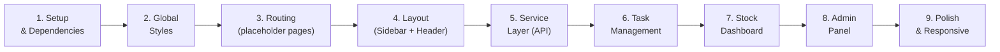

# 📘 Hướng dẫn xây dựng Mini App - Từng bước

> Hướng dẫn chi tiết từ setup → layout → từng feature. Làm từ từ, mỗi bước test xong mới qua bước tiếp.

---

## Mục lục

- [Bước 1: Setup Project & Cài dependencies](#bước-1-setup-project--cài-dependencies)
- [Bước 2: Cấu hình Global Styles](#bước-2-cấu-hình-global-styles)
- [Bước 3: Thiết lập Routing](#bước-3-thiết-lập-routing)
- [Bước 4: Dựng Layout (Sidebar + MainContent)](#bước-4-dựng-layout-sidebar--maincontent)
- [Bước 5: Tạo Service Layer (API)](#bước-5-tạo-service-layer-api)
- [Bước 6: Task Management](#bước-6-task-management)
- [Bước 7: Stock Dashboard](#bước-7-stock-dashboard)
- [Bước 8: Admin Panel](#bước-8-admin-panel)
- [Bước 9: Polish & Responsive](#bước-9-polish--responsive)

---

## Bước 1: Setup Project & Cài dependencies

### 1.1 Cài thêm react-router-dom

```bash
npm install react-router-dom
```

### 1.2 Tạo cấu trúc thư mục

```bash
# Tạo các thư mục cần thiết
mkdir src/pages
mkdir src/contexts
mkdir src/hooks
mkdir src/components/shared
mkdir src/components/tasks
mkdir src/components/stocks
mkdir src/components/admin
```

### 1.3 Cấu trúc sau bước này

```
src/
├── components/
│   ├── admin/        ← (trống, tạo sau)
│   ├── shared/       ← (trống, tạo sau)
│   ├── stocks/       ← (trống, tạo sau)
│   └── tasks/        ← (trống, tạo sau)
├── contexts/         ← (trống, tạo sau)
├── hooks/            ← (trống, tạo sau)
├── layout/           ← (trống, tạo sau)
├── pages/            ← (trống, tạo sau)
├── router/           ← (trống, tạo sau)
├── services/         ← (trống, tạo sau)
├── App.jsx
├── index.css
└── main.jsx
```

> [!TIP]
> **Checkpoint**: Chạy `npm run dev` để đảm bảo project vẫn hoạt động bình thường.

---

## Bước 2: Cấu hình Global Styles

### 2.1 Cập nhật `src/index.css`

```css
@import "tailwindcss";

/* Google Font - Inter */
@import url('https://fonts.googleapis.com/css2?family=Inter:wght@300;400;500;600;700&display=swap');

/* === CSS Variables cho Dark Theme === */
:root {
  --bg-primary: #0f172a;
  --bg-secondary: #1e293b;
  --bg-card: rgba(30, 41, 59, 0.8);
  --text-primary: #f8fafc;
  --text-secondary: #94a3b8;
  --accent: #3b82f6;
  --success: #10b981;
  --danger: #ef4444;
  --warning: #f59e0b;
  --border: rgba(148, 163, 184, 0.1);
  --sidebar-width: 260px;
}

/* === Global Reset === */
* {
  margin: 0;
  padding: 0;
  box-sizing: border-box;
}

body {
  font-family: 'Inter', sans-serif;
  background-color: var(--bg-primary);
  color: var(--text-primary);
  min-height: 100vh;
}

/* === Scrollbar === */
::-webkit-scrollbar {
  width: 6px;
}
::-webkit-scrollbar-track {
  background: var(--bg-primary);
}
::-webkit-scrollbar-thumb {
  background: var(--text-secondary);
  border-radius: 3px;
}

/* === Utility Animations === */
@keyframes fadeIn {
  from { opacity: 0; transform: translateY(10px); }
  to { opacity: 1; transform: translateY(0); }
}

.animate-fade-in {
  animation: fadeIn 0.3s ease-out;
}
```

> [!TIP]
> **Checkpoint**: Mở app, background phải chuyển sang màu tối `#0f172a`.

---

## Bước 3: Thiết lập Routing

### 3.1 Tạo placeholder pages

Tạo 3 file page đơn giản trước (sẽ xây dựng chi tiết sau):

**`src/pages/TaskPage.jsx`**
```jsx
export default function TaskPage() {
  return (
    <div className="animate-fade-in">
      <h1 className="text-2xl font-bold mb-4">📋 Task Management</h1>
      <p className="text-[var(--text-secondary)]">Coming soon...</p>
    </div>
  );
}
```

**`src/pages/StockPage.jsx`**
```jsx
export default function StockPage() {
  return (
    <div className="animate-fade-in">
      <h1 className="text-2xl font-bold mb-4">📈 Stock Dashboard</h1>
      <p className="text-[var(--text-secondary)]">Coming soon...</p>
    </div>
  );
}
```

**`src/pages/AdminPage.jsx`**
```jsx
export default function AdminPage() {
  return (
    <div className="animate-fade-in">
      <h1 className="text-2xl font-bold mb-4">⚙️ Admin Panel</h1>
      <p className="text-[var(--text-secondary)]">Coming soon...</p>
    </div>
  );
}
```

### 3.2 Tạo Router

**`src/router/AppRouter.jsx`**
```jsx
import { BrowserRouter, Routes, Route, Navigate } from "react-router-dom";
import MainLayout from "../layout/MainLayout";
import TaskPage from "../pages/TaskPage";
import StockPage from "../pages/StockPage";
import AdminPage from "../pages/AdminPage";

export default function AppRouter() {
  return (
    <BrowserRouter>
      <Routes>
        <Route element={<MainLayout />}>
          <Route path="/" element={<Navigate to="/tasks" replace />} />
          <Route path="/tasks" element={<TaskPage />} />
          <Route path="/stocks" element={<StockPage />} />
          <Route path="/admin" element={<AdminPage />} />
        </Route>
      </Routes>
    </BrowserRouter>
  );
}
```

### 3.3 Cập nhật `src/App.jsx`

```jsx
import AppRouter from "./router/AppRouter";

function App() {
  return <AppRouter />;
}

export default App;
```

> [!NOTE]
> Lúc này chưa có `MainLayout` nên app sẽ lỗi. Bước tiếp sẽ tạo layout.

---

## Bước 4: Dựng Layout (Sidebar + MainContent)

> **Đây là bước quan trọng nhất** - xây xong layout thì các page chỉ cần fill content vào.

### 4.1 Tạo Sidebar

**`src/layout/Sidebar.jsx`**
```jsx
import { NavLink } from "react-router-dom";

const navItems = [
  { path: "/tasks", label: "Task Management", icon: "📋" },
  { path: "/stocks", label: "Stock Dashboard", icon: "📈" },
  { path: "/admin", label: "Admin Panel", icon: "⚙️" },
];

export default function Sidebar({ isOpen, onToggle }) {
  return (
    <>
      {/* Overlay mobile */}
      {isOpen && (
        <div
          className="fixed inset-0 bg-black/50 z-40 lg:hidden"
          onClick={onToggle}
        />
      )}

      {/* Sidebar */}
      <aside
        className={`
          fixed top-0 left-0 z-50 h-full
          w-[var(--sidebar-width)]
          bg-[var(--bg-secondary)]/80 backdrop-blur-xl
          border-r border-[var(--border)]
          transition-transform duration-300 ease-in-out
          lg:translate-x-0
          ${isOpen ? "translate-x-0" : "-translate-x-full"}
        `}
      >
        {/* Logo */}
        <div className="p-6 border-b border-[var(--border)]">
          <h1 className="text-xl font-bold flex items-center justify-items-center gap-2">
            <span className="text-2xl">🚀</span>
            <span className="bg-gradient-to-r from-blue-400 to-purple-500 bg-clip-text text-transparent">
              Mini App
            </span>
          </h1>
          <p className="text-xs text-[var(--text-secondary)] mt-1">
            Dashboard v1.0
          </p>
        </div>

        {/* Navigation */}
        <nav className="p-4 flex flex-col gap-1">
          {navItems.map((item) => (
            <NavLink
              key={item.path}
              to={item.path}
              onClick={() => {
                // Close sidebar on mobile after click
                if (window.innerWidth < 1024) onToggle();
              }}
              className={({ isActive }) =>
                `flex items-center gap-3 px-4 py-3 rounded-xl
                 text-sm font-medium transition-all duration-200
                 ${
                   isActive
                     ? "bg-[var(--accent)] text-white shadow-lg shadow-blue-500/25"
                     : "text-[var(--text-secondary)] hover:bg-white/5 hover:text-white"
                 }`
              }
            >
              <span className="text-lg">{item.icon}</span>
              <span>{item.label}</span>
            </NavLink>
          ))}
        </nav>

        {/* Footer */}
        <div className="absolute bottom-0 left-0 right-0 p-4 border-t border-[var(--border)]">
          <p className="text-xs text-[var(--text-secondary)] text-center">
            React + Vite + TailwindCSS
          </p>
        </div>
      </aside>
    </>
  );
}
```

### 4.2 Tạo MainLayout

**`src/layout/MainLayout.jsx`**
```jsx
import { useState } from "react";
import { Outlet, useLocation } from "react-router-dom";
import Sidebar from "./Sidebar";

// Map path → page title
const pageTitles = {
  "/tasks": "Task Management",
  "/stocks": "Stock Dashboard",
  "/admin": "Admin Panel",
};

export default function MainLayout() {
  const [sidebarOpen, setSidebarOpen] = useState(false);
  const location = useLocation();
  const pageTitle = pageTitles[location.pathname] || "Mini App";

  return (
    <div className="min-h-screen">
      {/* Sidebar */}
      <Sidebar
        isOpen={sidebarOpen}
        onToggle={() => setSidebarOpen(!sidebarOpen)}
      />

      {/* Main Content */}
      <div className="lg:ml-[var(--sidebar-width)] min-h-screen transition-all duration-300">
        {/* Header */}
        <header className="sticky top-0 z-30 bg-[var(--bg-primary)]/80 backdrop-blur-lg border-b border-[var(--border)]">
          <div className="flex items-center justify-between px-6 py-4">
            {/* Mobile menu button */}
            <button
              onClick={() => setSidebarOpen(!sidebarOpen)}
              className="lg:hidden p-2 rounded-lg hover:bg-white/5 transition-colors"
            >
              <span className="text-xl">☰</span>
            </button>

            {/* Page title */}
            <h2 className="text-lg font-semibold">{pageTitle}</h2>

            {/* Placeholder for future actions */}
            <div className="w-8" />
          </div>
        </header>

        {/* Page Content */}
        <main className="p-6">
          <Outlet />
        </main>
      </div>
    </div>
  );
}
```

> [!TIP]
> **Checkpoint**: Chạy `npm run dev`. Bạn phải thấy:
> - Sidebar bên trái (desktop) hoặc hamburger menu (mobile)
> - 3 link navigation hoạt động, click chuyển page
> - Active link highlight màu xanh
> - Header hiển thị tên page đúng

---

## Bước 5: Tạo Service Layer (API)

### 5.1 Stock API Service

**`src/services/stockApi.js`**
```js
const BASE_URL_LIST = "https://test-webtrading.upse.vn";
const BASE_URL_DATA = "https://protrade.upstock.com.vn";

/**
 * Lấy danh sách tất cả mã chứng khoán
 * Gọi 1 lần, cache kết quả
 */
export async function fetchAllStocks() {
  const response = await fetch(`${BASE_URL_LIST}/getlistallstock`);
  if (!response.ok) throw new Error("Failed to fetch stock list");

  const data = await response.json();
  // Chỉ lấy mã cổ phiếu (stock_type = 'S'), bỏ chứng quyền
  return data.filter((item) => item.stock_type === "S");
}

/**
 * Lấy data realtime theo danh sách mã
 * @param {string[]} symbols - VD: ['VHM', 'VIC', 'HPG']
 */
export async function fetchStockData(symbols) {
  if (!symbols.length) return [];
  const symbolStr = symbols.join(",");
  const response = await fetch(
    `${BASE_URL_DATA}/getliststockdata/${symbolStr}`
  );
  if (!response.ok) throw new Error("Failed to fetch stock data");
  return response.json();
}
```

### 5.2 Task Service (localStorage)

**`src/services/taskApi.js`**
```js
const STORAGE_KEY = "miniapp_tasks";

function getStoredTasks() {
  const raw = localStorage.getItem(STORAGE_KEY);
  return raw ? JSON.parse(raw) : [];
}

function saveTasks(tasks) {
  localStorage.setItem(STORAGE_KEY, JSON.stringify(tasks));
}

export function getTasks() {
  return getStoredTasks();
}

export function addTask(task) {
  const tasks = getStoredTasks();
  const newTask = {
    id: Date.now().toString(),
    title: task.title,
    description: task.description || "",
    priority: task.priority || "medium",
    completed: false,
    createdAt: new Date().toISOString(),
  };
  tasks.unshift(newTask);
  saveTasks(tasks);
  return newTask;
}

export function updateTask(id, updates) {
  const tasks = getStoredTasks();
  const index = tasks.findIndex((t) => t.id === id);
  if (index === -1) throw new Error("Task not found");
  tasks[index] = { ...tasks[index], ...updates };
  saveTasks(tasks);
  return tasks[index];
}

export function deleteTask(id) {
  const tasks = getStoredTasks().filter((t) => t.id !== id);
  saveTasks(tasks);
}
```

> [!TIP]
> **Checkpoint**: Import thử `fetchAllStocks()` trong `StockPage` và log kết quả ra console để test API.

---

## Bước 6: Task Management

### 6.1 Tạo TaskContext

**`src/contexts/TaskContext.jsx`**
```jsx
import { createContext, useContext, useReducer, useEffect } from "react";
import * as taskApi from "../services/taskApi";

const TaskContext = createContext(null);

// Reducer
function taskReducer(state, action) {
  switch (action.type) {
    case "LOAD_TASKS":
      return { ...state, tasks: action.payload };
    case "ADD_TASK":
      return { ...state, tasks: [action.payload, ...state.tasks] };
    case "UPDATE_TASK":
      return {
        ...state,
        tasks: state.tasks.map((t) =>
          t.id === action.payload.id ? action.payload : t
        ),
      };
    case "DELETE_TASK":
      return {
        ...state,
        tasks: state.tasks.filter((t) => t.id !== action.payload),
      };
    case "SET_FILTER":
      return { ...state, filter: action.payload };
    case "SET_SEARCH":
      return { ...state, search: action.payload };
    default:
      return state;
  }
}

const initialState = {
  tasks: [],
  filter: "all", // all | active | completed
  search: "",
};

// Provider
export function TaskProvider({ children }) {
  const [state, dispatch] = useReducer(taskReducer, initialState);

  // Load tasks on mount
  useEffect(() => {
    const tasks = taskApi.getTasks();
    dispatch({ type: "LOAD_TASKS", payload: tasks });
  }, []);

  // Actions
  const actions = {
    addTask: (task) => {
      const newTask = taskApi.addTask(task);
      dispatch({ type: "ADD_TASK", payload: newTask });
    },
    updateTask: (id, updates) => {
      const updated = taskApi.updateTask(id, updates);
      dispatch({ type: "UPDATE_TASK", payload: updated });
    },
    toggleTask: (id) => {
      const task = state.tasks.find((t) => t.id === id);
      if (task) {
        const updated = taskApi.updateTask(id, { completed: !task.completed });
        dispatch({ type: "UPDATE_TASK", payload: updated });
      }
    },
    deleteTask: (id) => {
      taskApi.deleteTask(id);
      dispatch({ type: "DELETE_TASK", payload: id });
    },
    setFilter: (filter) => dispatch({ type: "SET_FILTER", payload: filter }),
    setSearch: (search) => dispatch({ type: "SET_SEARCH", payload: search }),
  };

  // Filtered tasks
  const filteredTasks = state.tasks.filter((task) => {
    const matchFilter =
      state.filter === "all" ||
      (state.filter === "active" && !task.completed) ||
      (state.filter === "completed" && task.completed);
    const matchSearch = task.title
      .toLowerCase()
      .includes(state.search.toLowerCase());
    return matchFilter && matchSearch;
  });

  return (
    <TaskContext.Provider value={{ state, actions, filteredTasks }}>
      {children}
    </TaskContext.Provider>
  );
}

export function useTask() {
  const context = useContext(TaskContext);
  if (!context) throw new Error("useTask must be used within TaskProvider");
  return context;
}
```

### 6.2 Tạo các components cho Task

> [!NOTE]
> Tạo lần lượt: TaskFilter → TaskForm → TaskItem → TaskList. Mỗi component test xong mới qua cái tiếp.

**`src/components/tasks/TaskFilter.jsx`** — Thanh filter + search

**`src/components/tasks/TaskForm.jsx`** — Form tạo task mới (title, priority)

**`src/components/tasks/TaskItem.jsx`** — Card hiển thị 1 task (toggle, edit, delete)

**`src/components/tasks/TaskList.jsx`** — Render danh sách TaskItem

### 6.3 Cập nhật TaskPage

Wrap page với `TaskProvider`, render TaskFilter + TaskForm + TaskList.

---

## Bước 7: Stock Dashboard

### 7.1 Tạo StockContext

- `fetchAllStocks()` → gọi 1 lần khi mount, cache vào state
- `fetchStockData(watchlist)` → polling mỗi 10s

### 7.2 Tạo custom hook `src/hooks/useStockPolling.js`

```js
import { useEffect, useRef } from "react";

export function useStockPolling(callback, interval = 10000, deps = []) {
  const savedCallback = useRef(callback);

  useEffect(() => {
    savedCallback.current = callback;
  }, [callback]);

  useEffect(() => {
    savedCallback.current(); // Gọi ngay lần đầu
    const id = setInterval(() => savedCallback.current(), interval);
    return () => clearInterval(id);
  }, [interval, ...deps]);
}
```

### 7.3 Tạo các components cho Stock

- **StockSearch** — Autocomplete search, thêm mã vào watchlist
- **StockTable** — Bảng giá realtime (color coding: xanh tăng, đỏ giảm, vàng tham chiếu)
- **MarketOverview** — Stats tổng quan

---

## Bước 8: Admin Panel

### 8.1 Tạo AdminContext

- Load data từ stock API (danh sách mã) làm dataset
- State: data, filters, sort, pagination

### 8.2 Tạo các components cho Admin

- **FilterPanel** — Filter theo Sàn (HOSE/HNX/UPCOM), Ngành, search text
- **DataTable** — Bảng data generic, sortable columns
- **Pagination** — Phân trang (10/25/50 items per page)

---

## Bước 9: Polish & Responsive

### 9.1 Shared Components

Tạo các components dùng chung:
- `LoadingSpinner` — Loading indicator
- `EmptyState` — Placeholder khi không có data
- `Modal` — Dialog cho form edit
- `Badge` — Badge cho priority, status

### 9.2 Responsive

- Desktop: Sidebar cố định bên trái
- Tablet: Sidebar collapse được
- Mobile: Sidebar ẩn, hiện qua hamburger menu

### 9.3 Final Checklist

- [ ] Routing hoạt động (3 pages)
- [ ] State management với Context + useReducer
- [ ] API call thật (stock APIs)
- [ ] localStorage persist (tasks)
- [ ] Clean code (tách file, naming convention)
- [ ] Responsive layout
- [ ] Dark theme nhất quán
- [ ] Loading states
- [ ] Error handling

---

## Thứ tự thực hiện tóm tắt



> [!IMPORTANT]
> **Nguyên tắc**: Hoàn thành từng bước, test xong mới qua bước tiếp. Không nhảy bước!
